# Firewall Configuration: Zone-Based Firewall with pfSense

## Context
Built as part of my Cert IV in Cybersecurity (Network Security unit). The brief was to design and build a firewall with LAN, DMZ, and Internet zones, define least-privilege firewall rules for each zone, and then actually prove those rules work using real traffic tests — not just show the configuration screens.

## Objective
Configure a pfSense firewall with three zones (LAN, DMZ, Internet/WAN), apply NAT so internal hosts can reach the internet, define tightly-scoped firewall rules per zone, and verify every rule with live testing tools (curl, nslookup, ping) from hosts in each zone.

## Architecture

Two Linux test hosts were used: PC-A on the LAN, and PC-B on the DMZ (running Apache, to act as an internal web server). The firewall (FW1) sits between the Internet, LAN, and DMZ, each on its own interface/zone.

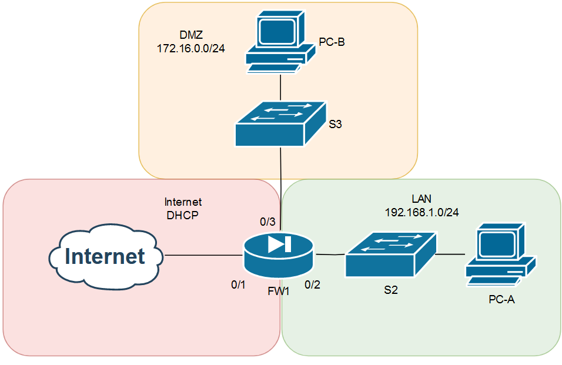

| Device | Interface | IP | Zone |
|---|---|---|---|
| FW1 | Interface 1 | DHCP | Internet/WAN |
| FW1 | Interface 2 | 192.168.1.1/24 | LAN |
| FW1 | Interface 3 | 172.16.0.1/24 | DMZ |
| PC-A | Ethernet | DHCP | LAN |
| PC-B | Ethernet | 172.16.0.10/24 | DMZ |

## Build Process

### 1. NAT configuration
Configured automatic outbound NAT so hosts in both the LAN and DMZ could reach the internet through the firewall's WAN interface, then confirmed it was working before layering firewall rules on top.

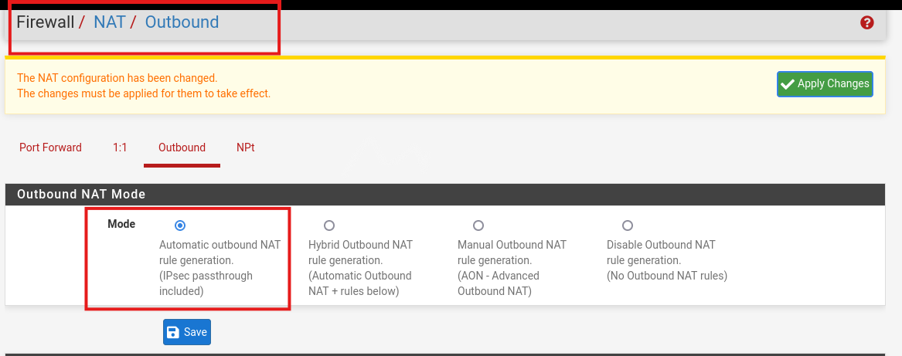

### 2. Zone-based firewall rules
Defined firewall rules per zone based on a least-privilege model — each zone only gets exactly the access it needs, everything else is implicitly or explicitly blocked.

**LAN zone:** allow HTTP, HTTPS, and ICMP echo-request to any destination; allow DNS and NTP only to the firewall's own LAN address (not out to the internet); block everything else.

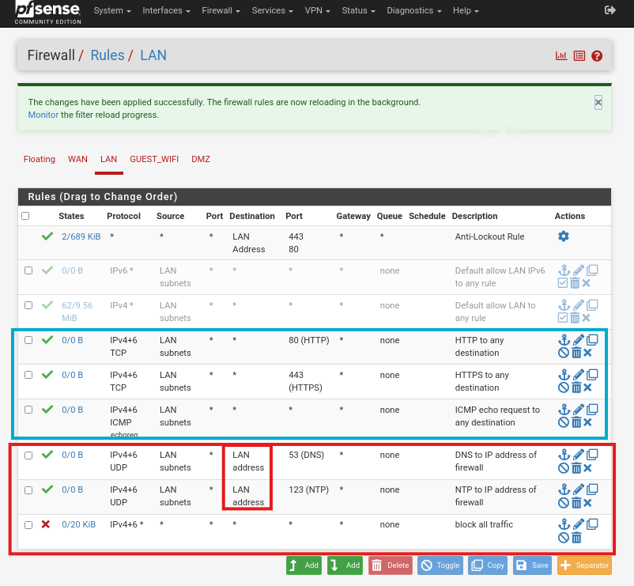

**Internet/WAN zone:** no inbound connections permitted from anywhere except what's already handled by the NAT rule — the WAN interface has no open pass rules of its own.

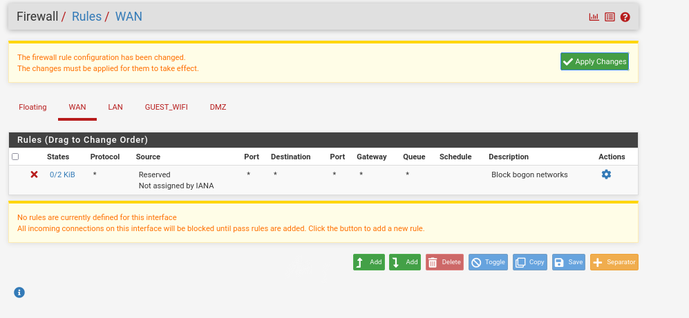

**DMZ zone:** block all traffic destined for the LAN; permit HTTP, HTTPS, DNS, NTP, and ICMP echo-request out to the internet.

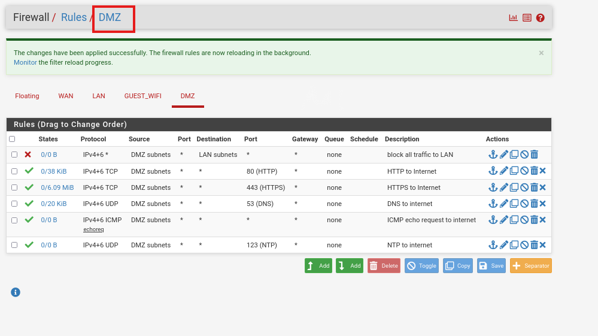

## Testing & Verification
Rather than just trusting the rule configuration, I tested each rule from the actual zone it applied to, using curl, nslookup, and ping — checking both that permitted traffic worked and that blocked traffic was actually being blocked.

**From the LAN (PC-A):**

- HTTP to an external site succeeds (allowed): `curl example.com`
-   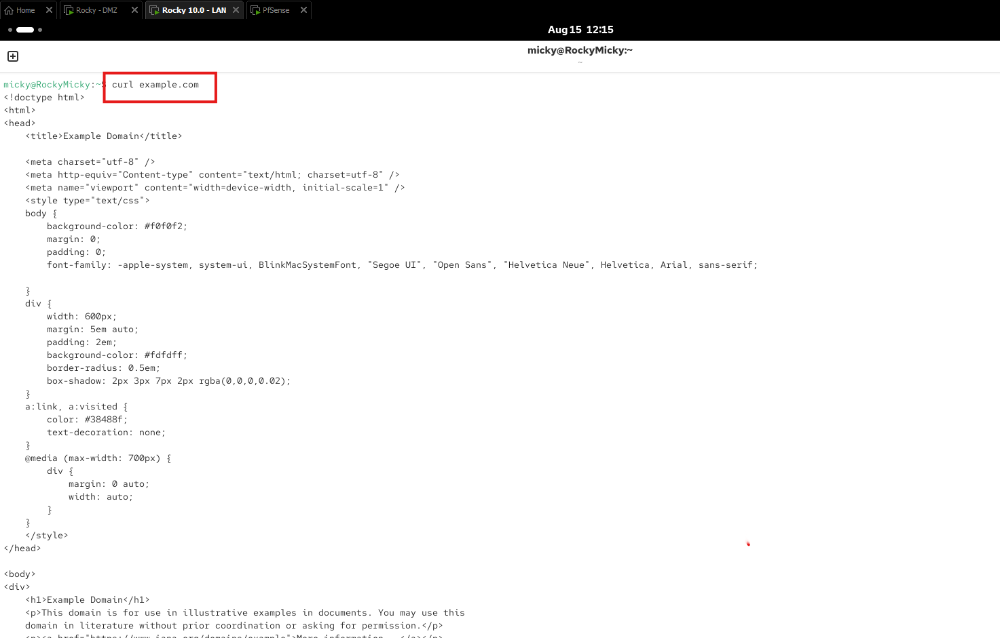
-   - DNS lookup against an arbitrary external resolver times out (correctly blocked — LAN can only query the firewall itself):
    -   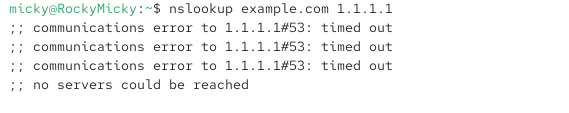
    -   - DNS lookup against the firewall's own LAN address succeeds (allowed):
        -   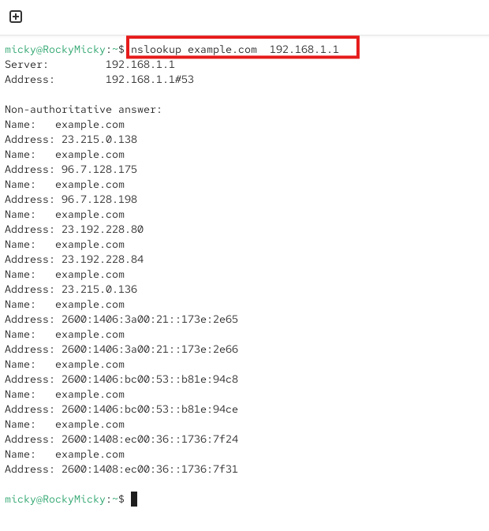
        -   - Ping to an external host succeeds (ICMP echo-request allowed to any destination):
            -   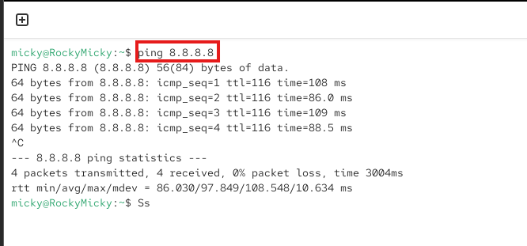
         
            -   **From the DMZ (PC-B):**
         
            -   - HTTP to an external site succeeds (allowed):
                -   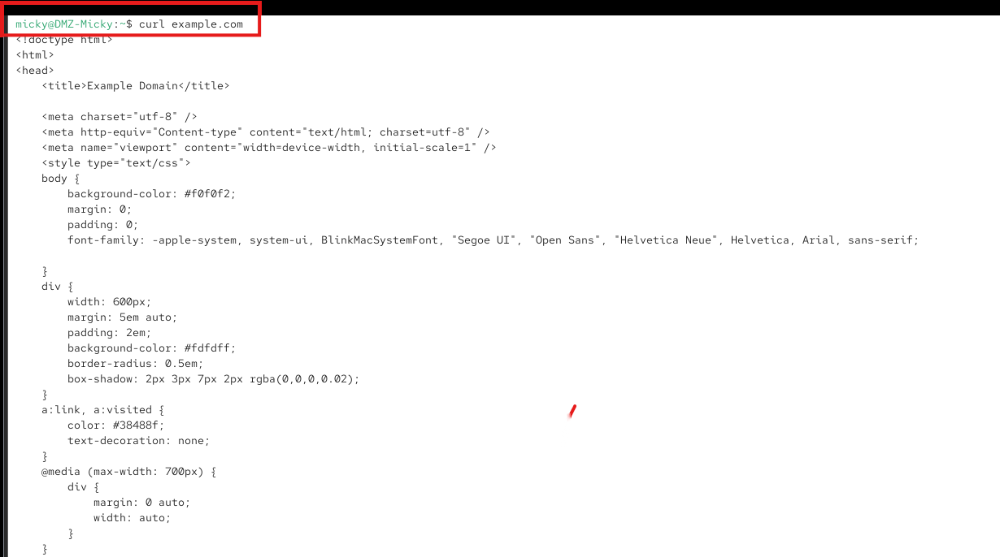
                -   - DNS to an external resolver succeeds (DMZ is permitted to reach external DNS, unlike LAN):
                    -   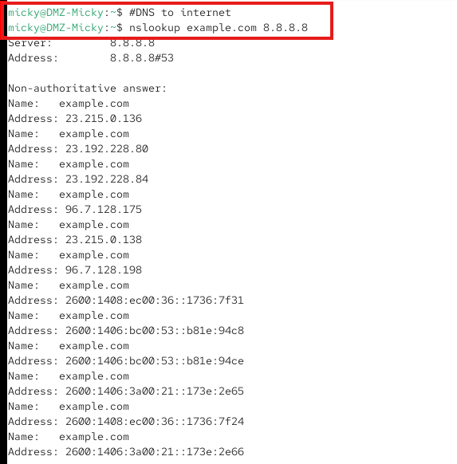
                    -   - HTTP request to a host on the LAN fails to connect (correctly blocked — DMZ cannot reach LAN):
                        -   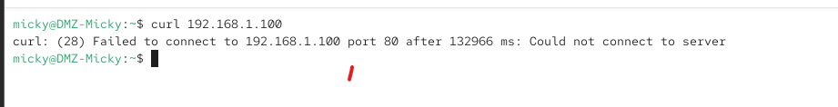
                        -   - Combined test: ping to the internet succeeds, while ping to both the firewall's LAN address and a LAN host both fail with 100% packet loss — confirming the DMZ-to-LAN block is working in both directions of testing:
                            -   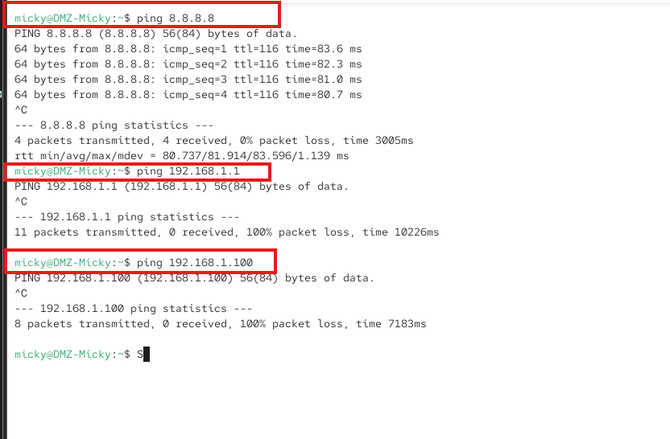
                         
                            -   ## IPv6
                            -   The LAN and DMZ interfaces were configured with static IPv4 addressing only — no IPv6 configuration was established on either interface, so IPv6 rule testing wasn't possible in this build. I confirmed and documented this rather than skipping it silently.
                         
                            -   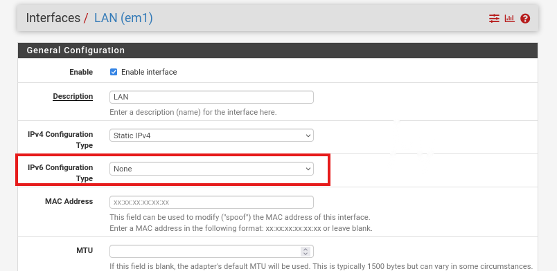
                         
                            -   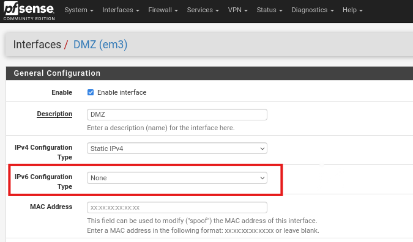
                         
                            -   ## Verification Summary
                            -   - NAT: confirmed both LAN and DMZ hosts can reach the internet through the firewall
                                - - LAN zone: HTTP/HTTPS/ICMP allowed to any destination — confirmed; DNS/NTP allowed only to the firewall itself — confirmed (blocked externally, allowed internally); all else blocked
                                  - - DMZ zone: LAN access blocked — confirmed (both HTTP and ICMP); HTTP/HTTPS/DNS/NTP/ICMP to internet allowed — confirmed
                                    - - WAN/Internet zone: no inbound access outside the NAT rule — confirmed
                                      - - IPv6: not configured on LAN/DMZ interfaces in this build, documented rather than assumed
                                       
                                        - ## Lessons Learned
                                        - The main thing this build reinforced was that a firewall rule isn't "done" when it's saved — it's done when you've tested both sides of it: that the traffic you meant to allow actually gets through, and that the traffic you meant to block actually gets stopped. The DMZ ping test was a good example of this — testing internet connectivity alone would have looked like a pass, but it was the LAN-blocked pings failing (as expected) that actually proved the zone isolation was correctly configured. I also learned to be honest in documentation about what wasn't tested (IPv6) rather than glossing over a gap.
                                       
                                        - ## Tools & Technologies
                                        - - pfSense (zone-based firewall)
                                          - - NAT (outbound, automatic mode)
                                            - - curl, nslookup, ping (rule verification)
                                              - - Enterprise Linux (test hosts, one running Apache as a DMZ web server)
                                                - 
