# VPN Tunnel: Site-to-Site and Client-to-Site VPN with pfSense

## Context
Built as part of my Cert IV in Cybersecurity (Network Security unit), on top of a pfSense firewall base build (see the [Firewall Configuration](../Firewall-Configuration/README.md) section of this repo). The brief was to connect two simulated office sites over a secure tunnel and provide encrypted remote access for individual users, then prove both actually work with real connectivity tests.

## Objective
Connect two pfSense firewalls with an IPSec site-to-site VPN, add a client-to-site OpenVPN option for remote workers, and verify both with real traffic — not just a green "Established" status.

## Architecture

The final build had three logical zones: the main LAN behind FW-1, a remote office behind FW-2 connected via IPSec, and a remote/roaming worker connecting in over OpenVPN.

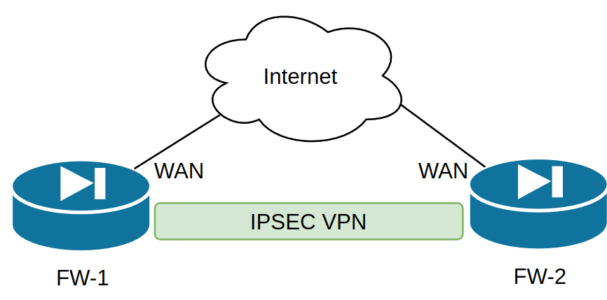

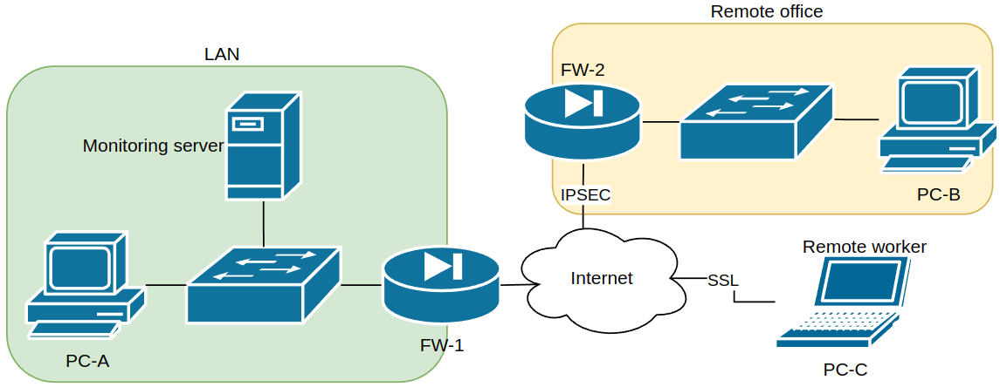

## Build Process

### 1. Site-to-site IPSec VPN
Stood up a second firewall (FW-2) and test PC (PC-B) to represent a remote office. Before building the tunnel, I ran a port scan from each site against the other's WAN interface to confirm no ports were exposed prior to VPN configuration — a basic sanity check that the firewalls weren't leaking anything to the internet ahead of the VPN going live.

I then set the IPSec cryptographic parameters based on the (fictional) client's supplied cryptographic policy — AES-256 for encryption, SHA-256 for hashing, and a 2048-bit Diffie-Hellman group — configured the tunnel between FW-1 and FW-2, and confirmed both sides completed IKE Phase 1 and Phase 2 negotiation successfully.

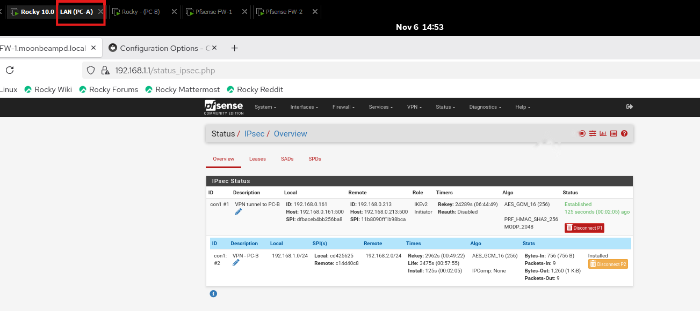

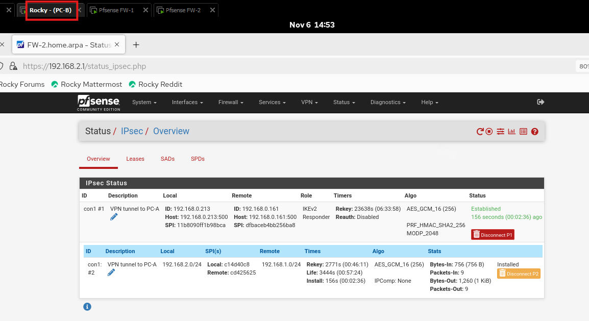

To actually prove the tunnel worked (rather than just trusting the "Established" status), I ran ping and SSH tests in both directions between PC-A and PC-B across the tunnel:

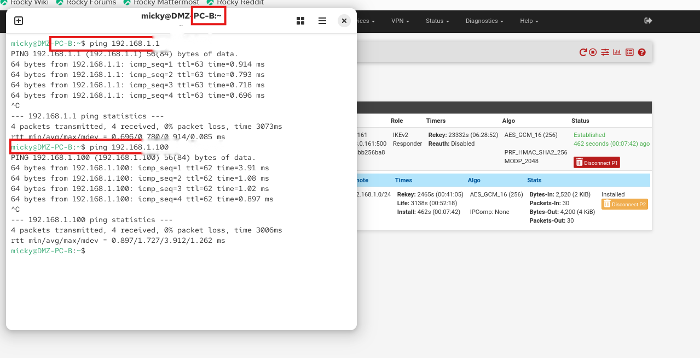

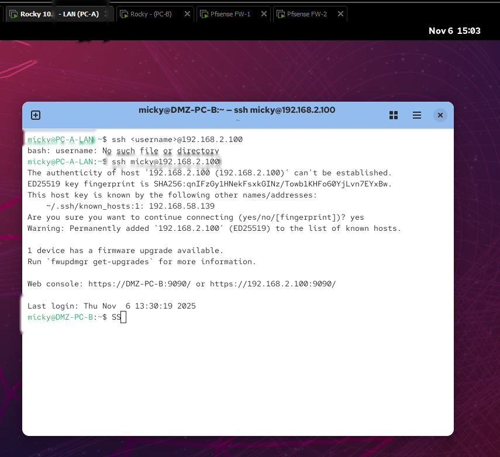

### 2. Client-to-site remote access VPN
Added a third client machine (PC-C) to represent a remote/roaming worker, then configured an OpenVPN remote-access server on FW-1 — generating a server certificate, setting the tunnel network and cipher suite, and creating a standard (non-admin) user account with its own client certificate for authentication.

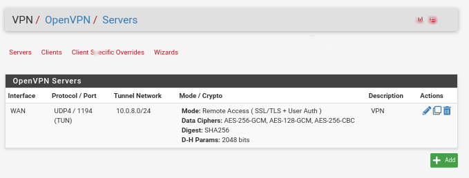

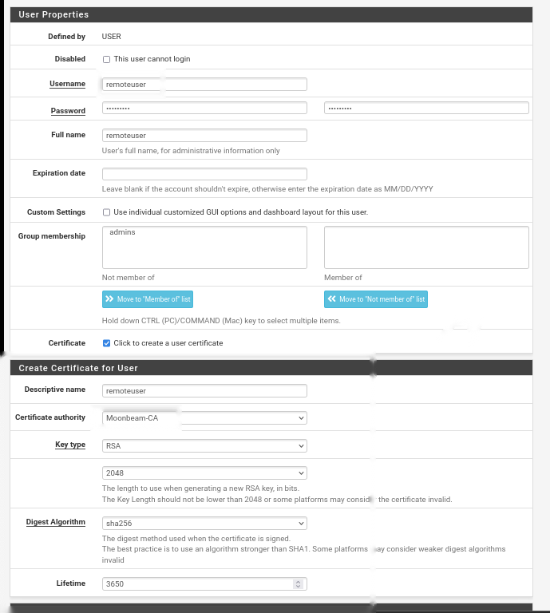

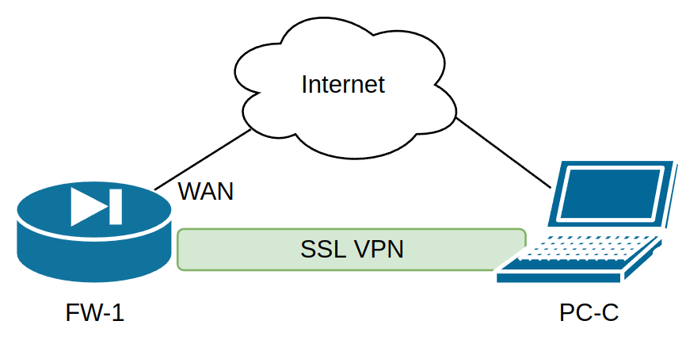

Installed the OpenVPN client on PC-C, connected it to FW-1, and confirmed the tunnel was live:

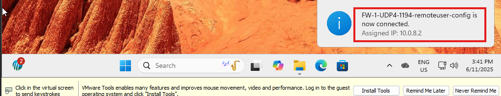

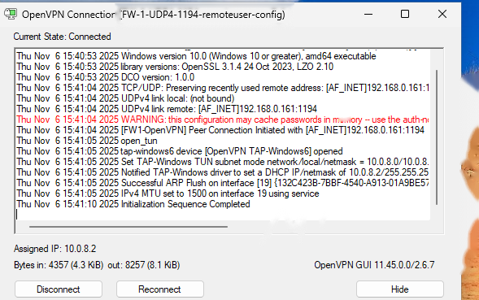

Then tested actual connectivity from the remote client back into the LAN — pinging both FW-1 and PC-A across the tunnel to confirm the remote worker had real access, not just a connected-looking VPN client:

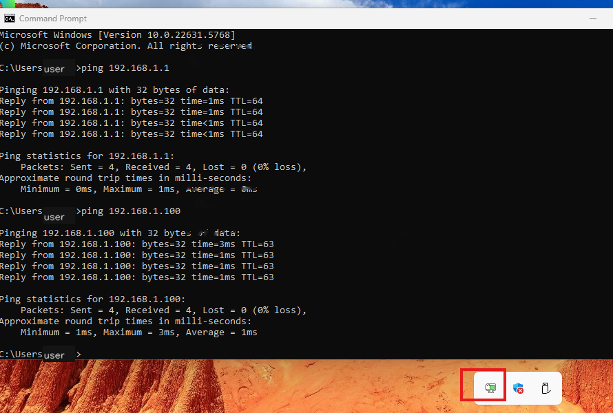

## Troubleshooting Reference
Partway through, I looked into common OpenVPN client error messages so I'd recognise them if they came up during testing or in a real deployment:

| Error | Likely Cause | Fix |
|---|---|---|
| `X509 - date tag or value is invalid` | Certificate expired, not yet valid, or client/server clock is out of sync | Check date/time on both client and server; reissue the certificate if it's actually expired |
| `DNS lookup failed` (e.g. `server.example.com` not found) | Client is trying to resolve a hostname that doesn't exist or isn't reachable | Confirm the server address in the client config; replace the hostname with the correct WAN IP or a working public hostname |
| `certificate is not yet valid` | Certificate's validity start date is in the future | Check system clock on both ends; if correct, reissue the cert with the valid-from date set to today or earlier, accounting for timezone differences |

## Verification Summary
- IPSec site-to-site tunnel: established and confirmed from both FW-1 and FW-2's status pages
- Cross-site connectivity: verified with ping and SSH between PC-A and PC-B
- Client-to-site OpenVPN: connected successfully, assigned a tunnel IP, and verified with ping from the remote client back into the LAN
- Pre-VPN port scans: confirmed no exposed ports on either firewall's WAN interface before the tunnels went live

## Lessons Learned
The biggest shift in mindset for me here was that a "successful" VPN isn't just a green "Established" status — that only confirms the tunnel negotiated correctly, not that traffic can actually pass through it the way it's supposed to. Running the ping/SSH tests in both directions, and specifically testing the client-to-site connection against two different internal targets (not just the firewall itself), was what actually proved the build worked end-to-end. I also found that reading through real OpenVPN error messages ahead of time — rather than only troubleshooting reactively — made the whole client setup process faster, since I already had a rough idea of what a misconfigured certificate or DNS issue would look like.

## Tools & Technologies
- pfSense (VPN gateway)
- IPSec (site-to-site VPN, IKEv2)
- OpenVPN (client-to-site remote access VPN)
- Nmap (pre-VPN port scanning)
- VMware (virtualised lab environment)
