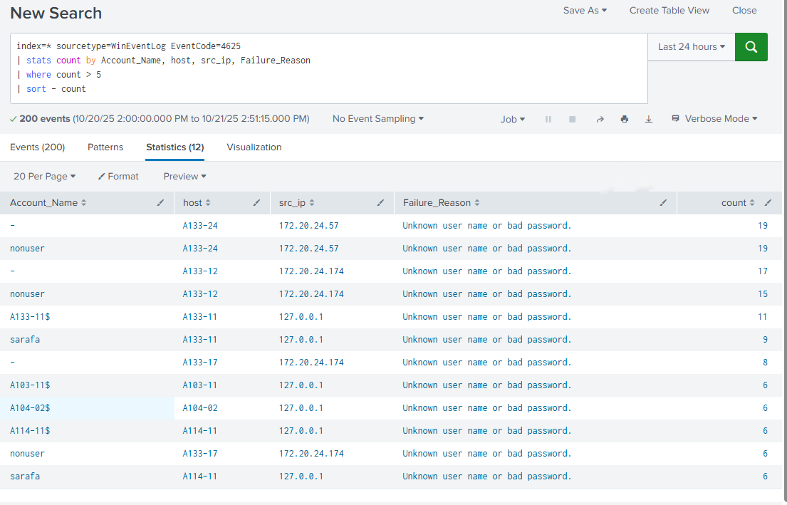
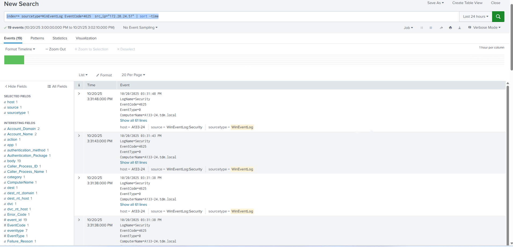
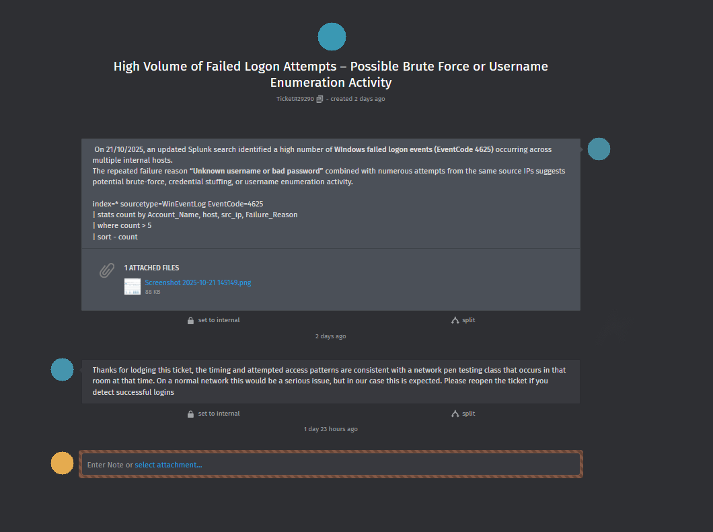

[README.md](https://github.com/user-attachments/files/30922597/README.md)
# Incident 1: High-Volume Failed Logon Activity — Possible Brute Force / Username Enumeration

## Context
Built as part of my Cert IV in Cybersecurity, using a simulated Windows domain environment (Splunk SIEM ingesting Windows Security Event Logs from a domain controller and several workstations). This was written up as a formal incident log/report to practice real SOC workflow: detect → investigate → hypothesize → recommend.

## Objective
Investigate a spike in Windows failed logon events to determine whether the activity was malicious (brute force / credential stuffing / enumeration) or benign.

## Investigation

**Initial detection query** — surface accounts/hosts with unusually high failed-logon counts:

```spl
index=* sourcetype=WinEventLog EventCode=4625
| stats count by Account_Name, host, src_ip, Failure_Reason
| where count > 5
| sort -count
```

This pulls all EventCode 4625 (failed logon) events, groups them by account, host, source IP, and failure reason, then filters to only combinations with more than 5 failures — cutting out normal one-off typos and isolating patterns worth investigating.

**Result:** 200 events over ~24 hours, with several accounts/hosts showing 15–19 failed attempts each — well above what a single user mistyping a password would produce.

**Follow-up query** — pivot on the most active source IP to build a timeline:

```spl
index=* sourcetype=WinEventLog EventCode=4625 src_ip="172.20.24.57" | sort -time
```

This isolates every failed logon from the top offending source IP and orders it chronologically, to see whether the attempts looked automated (tight, regular intervals) versus a human fumbling a password.





## Findings
- 200 failed logon events (EventCode 4625) across multiple domain-joined hosts (A133-24, A133-12, A104-02, A114-11) in a ~24-hour window.
- Two consistent originating sources: `172.20.24.57` and local loopback `127.0.0.1`, both showing repeated attempts.
- Failure reason was consistently **"Unknown user name or bad password"** — a strong indicator of automated/scripted attempts against accounts that don't exist, rather than a legitimate user struggling to log in.
- Some accounts saw 19+ failed attempts, well past a normal lockout threshold.
- Activity was confined to the internal `172.20.24.0/24` range with no evidence of external connectivity.

## Hypothesis
The pattern — repeated failures across different accounts and hosts, consistent source IP, and non-existent usernames — points to either an external actor performing credential stuffing/username enumeration, or a misconfigured internal service attempting repeated authentication. The consistency of the source IP and the "unknown username" failure reason made malicious enumeration or brute force the more likely explanation over simple user error.

## MITRE ATT&CK Mapping

| Technique | ID | Tactic |
|---|---|---|
| Brute Force | T1110 | Credential Access |

## Recommendations
- Enforce account lockout thresholds (e.g. 5 failed logons within 15 minutes).
- Implement MFA for administrator accounts.
- Block or actively monitor source IP `172.20.24.57` for further activity.
- Investigate the affected endpoints directly (A133-24, A133-12, A104-02, A114-11).
- Review password policy for complexity requirements and lockout duration.
- Add a real-time alert for >5 failed logons per minute per account.
- Correlate against EventCode 4740 (account lockout) and 4624 (successful logon) to check whether any attempt actually succeeded.

## Response & Outcome
The investigation was logged as a ticket and escalated for confirmation. A colleague on the network team confirmed that the timing and access pattern matched a scheduled network penetration-testing class running in that room at that time — on a production network this pattern would be treated as a genuine incident, but in this case it was expected, authorized activity. The ticket was closed with instructions to reopen if any of the attempts had resulted in a successful logon (none did).



This is a useful outcome in its own right: the detection and escalation process worked correctly — the activity was caught, investigated, and correctly escalated for context before being closed — which is exactly the workflow a SOC analyst is expected to follow even when an alert ultimately turns out to be a false positive.

## Lessons Learned
This was one of the investigations that helped me get comfortable moving from a single broad search to a targeted, pivoted query — starting wide (`stats count by...`) to spot the anomaly, then narrowing to a specific source IP to build a clean timeline. It also reinforced why failure *reason* matters as much as failure *count*: "unknown username" tells a very different story than "bad password" against a real account.

## Sources Referenced
- Microsoft documentation — Event ID 4625 (failed logon)
- MITRE ATT&CK Framework — Brute Force (T1110)
- OWASP Top 10 — Authentication Failures (2023)
