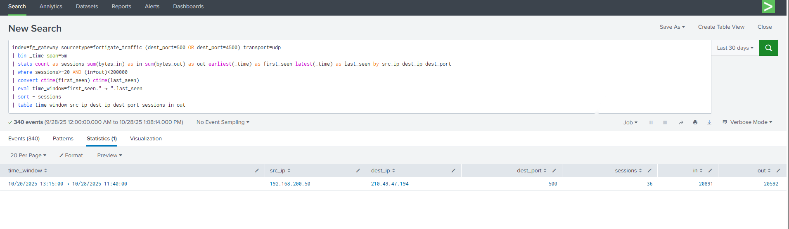
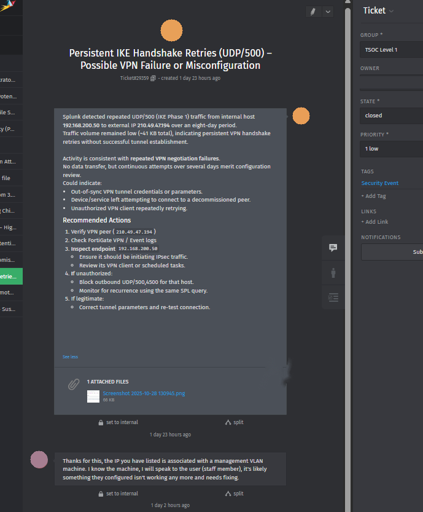

# Incident 2: Persistent IKE Handshake Retries (UDP/500) — Possible Reconnaissance or Unauthorized VPN Activity

## Context
Built as part of my Cert IV in Cybersecurity, using a simulated network environment with FortiGate firewall traffic logs ingested into Splunk. Written up as a formal incident log/report to practice SOC investigation workflow on non-Windows log sources — firewall/network traffic rather than host event logs.

## Objective
Investigate a pattern of repeated, low-volume IKE (VPN) handshake attempts from an internal host to an external IP, and determine whether it represented a misconfiguration, a stale/decommissioned VPN peer, or unauthorized/malicious activity.

## Investigation

**Detection query** — surface repeated IKE/NAT-T sessions with unusually high session counts but low data transfer:

```spl
index=fg_gateway sourcetype=fortigate_traffic (dest_port=500 OR dest_port=4500) transport=udp
| bin _time span=5m
| stats count as sessions sum(bytes_in) as in sum(bytes_out) as out earliest(_time) as first_seen latest(_time) as last_seen by src_ip dest_ip dest_port
| where sessions>=20 AND (in+out)<200000
| convert ctime(first_seen) ctime(last_seen)
| eval time_window=first_seen." → ".last_seen
| sort -sessions
| table time_window src_ip dest_ip dest_port sessions in out
```

This filters FortiGate traffic logs to VPN negotiation ports (UDP 500/4500), buckets activity into 5-minute windows, and isolates host/destination pairs with a high session count but very little actual data transferred — the signature of repeated handshake attempts that never establish a working tunnel, rather than normal VPN usage.

**Result:** A single internal host (`192.168.200.50`) showed a persistent pattern of IKE handshake attempts to one external IP (`210.49.47.194`) spanning 20–28 October 2025 — 340 events, 36 sessions in the most recent window, only ~41KB of data transferred in total.



## Findings
- Persistent UDP/500 (IKE Phase 1) traffic from internal host `192.168.200.50` to external IP `210.49.47.194` over an 8-day period.
- Low total data volume (~41KB) despite a high session/attempt count — consistent with repeated handshake negotiation failures rather than an established, actively-used tunnel.
- Activity was isolated to a single internal host; no similar pattern observed on other internal subnets.
- No evidence of a successful tunnel establishment or data exfiltration.

## Hypothesis
The combination of a consistent destination, low data volume, and repeated negotiation attempts over multiple days pointed to one of two explanations: a misconfigured or outdated VPN client on the internal host continuously retrying authentication against a peer it could no longer reach, or an unauthorized/compromised process attempting to establish or brute-force a VPN tunnel. The lack of any successful data exchange made the second explanation less immediately alarming, but the persistence and consistent targeting still warranted investigation rather than being dismissed as noise.

## MITRE ATT&CK Mapping

| Technique | ID | Tactic |
|---|---|---|
| Remote Services (VPN) | T1021 (referenced as T1563 in original notes) | Lateral Movement |
| Network Service Scanning | T1046 | Discovery |

## Recommendations
- Verify whether the external IP (`210.49.47.194`) belongs to a known/authorized VPN peer.
- Check FortiGate VPN and event logs for matching IKE Phase 1 negotiation failure codes.
- Inspect the internal endpoint (`192.168.200.50`) to confirm it is intentionally configured for VPN connectivity, and check for unknown VPN software or scheduled tasks initiating the traffic.
- If unauthorized: temporarily block outbound/inbound UDP 500/4500 from the host until verified.
- If legitimate but misconfigured: correct the tunnel parameters/credentials and re-test.
- Implement a Splunk alert for >20 IKE session attempts within 5 minutes from a single host, to catch this pattern automatically in future.

## Response & Outcome
The investigation was logged as a ticket and escalated to the network team. A colleague confirmed that the source IP belonged to a device on the management VLAN, and identified the likely cause as a staff member's VPN client that was no longer configured correctly, rather than malicious activity. The ticket was closed with follow-up action to correct the client configuration.



As with the first investigation, the value here wasn't just the technical detection — it was following through the full workflow: query, hypothesize, escalate, and get confirmation before closing, rather than assuming either "definitely malicious" or "definitely fine" without checking.

## Lessons Learned
This investigation pushed me past Windows event logs into firewall/network traffic analysis, which required a different way of thinking about anomalies — instead of looking for a specific failure code, I had to look for a *shape* in the traffic (many sessions, almost no data) rather than a single flagged event. Using `bin` and `stats` together to bucket traffic into time windows before filtering was the key technique that made the pattern visible. It also reinforced that "low severity" and "not worth investigating" aren't the same thing — this was correctly logged and chased down even though the impact turned out to be minimal.

## Sources Referenced
- FortiGate Firewall Logs documentation
- Fortinet Knowledge Base — IKE negotiation failure and Phase 1 diagnostics
- MITRE ATT&CK Framework — T1046 (Network Service Scanning), VPN-related remote service techniques
- WHOIS / IP reputation lookups for destination IP validation
